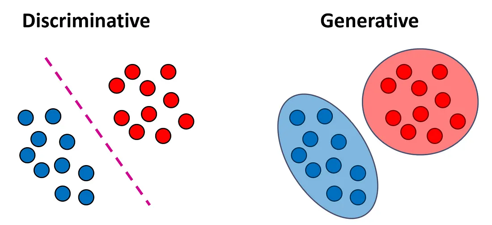

<!-- _class: titlepage -->

# Procesamiento del lenguaje natural

## Aprendizaje profundo

### Departamento de Sistemas Informáticos

#### E.T.S.I. de Sistemas Informáticos - UPM

---

# Introducción (I)

Dentro del aprendizaje automático existen tres técnicas/esquemas de entrenamiento

- **Supervisado**: Se presentan ejemplos y respuestas y el modelo aprende a inferir
- **No supervisado**: Se presentan datos y el modelo aprende patrones
- **Por refuerzo**: Se presenta un entorno y el modelo aprende a desenvolverse en él

<figure class="image">
    
    <figcaption><strong>Figura 1.</strong> Diferentes esquemas de aprendizaje. Fuente: MathWorks</figcaption>
</figure>

---

# Introducción (II)

Otro punto de vista permite describir los modelos de ML en dos categorías:

- **Discriminativos**: Predicen la probabilidad de pertenecer a una clase según los datos de entrada
- **Generativos**: Buscan modelar cómo se generan los datos observados y pueden generar nuevos datos similares

<figure class="image">
    
    <figcaption><strong>Figura 2.</strong> Modelos discriminativos frente a generativos. Fuente: Medium</figcaption>
</figure>

---

# Un poquito de historia<!--_class: section-->

---

# Primeros fundamentos

- **1960-1990**: Modelos probabilísticos clásicos. Se utilizan métodos estadísticos para modelar distribuciones de datos
  - Modelos de Márkov y modelos ocultos de Márkov (HMM, _hidden márkov models_) se aplican en el modelado de secuencias (e.g., reconocimiento del habla)1
  - Modelos de mezcla gaussiana (GMM, _gaussian mixture models_)2 permiten representar distribuciones complejas mediante la combinación de múltiples distribuciones simples
- **1980-1990**: Máquinas de Boltzmann y redes neuronales. Se introducen modelos generativos basados en redes neuronales3
- **2006**: Redes de creencia profundas (DBN, _deep belief networks_). Enfoque donde se apilan capas de modelos probabilísticos para aprender representaciones jerárquicas de datos de forma generativa 4.

> 1 Rabiner, L. R. (1989). [A tutorial on hidden Markov models and selected applications in speech recognition](https://ieeexplore.ieee.org/document/18626/). Proceedings of the IEEE, 77(2), 257-286.  
> 2 Reynolds, D. A. (2009). [_Gaussian mixture models_](https://leap.ee.iisc.ac.in/sriram/teaching/MLSP_16/refs/GMM_Tutorial_Reynolds.pdf). Encyclopedia of biometrics, 741(659-663), 3.  
> 3 Ackley, D. H., Hinton, G. E., & Sejnowski, T. J. (1985). [_A learning algorithm for Boltzmann machines_](https://www.sciencedirect.com/science/article/pii/S0364021385800124). Cognitive Science, 9(1), 147-169.  
> 4 Hinton, G. E., Osindero, S., & Teh, Y. W. (2006). [_A fast learning algorithm for deep belief nets_](https://direct.mit.edu/neco/article-abstract/18/7/1527/7065/A-Fast-Learning-Algorithm-for-Deep-Belief-Nets). Neural Computation, 18(7), 1527-1554.  

---

# La transformación a modelos generativos

- **2013**: Autoencoders variacionales (VAE, _variational adversarial networks_): Permiten aprender una representación latente continua y generan nuevos datos a partir de ella, combinando ideas de autoencoders y métodos bayesianos 5
- **2014**: Redes generativas antagónicas (GAN, _generative adversarial _networks_): Proponen un marco en el que dos redes neuronales (generadora y discriminadora) se entrenan de forma competitiva, logrando resultados impactantes en la generación de imágenes y otros dominios 6

> 5 Kingma, D. P., & Welling, M. (2013). [_Auto-encoding variational bayes_](http://web2.cs.columbia.edu/~blei/fogm/2018F/materials/KingmaWelling2013.pdf). arXiv preprint arXiv:1312.6114.  
> 6 Goodfellow, I., Pouget-Abadie, J., Mirza, M., Xu, B., Warde-Farley, D., Ozair, S., ... & Bengio, Y. (2014). [_Generative adversarial nets_](https://proceedings.neurips.cc/paper_files/paper/2014/hash/f033ed80deb0234979a61f95710dbe25-Abstract.html). Advances in Neural Information Processing Systems, 27.

---

# Evolución y especialización

<!-- título con la generalización para luego ir punto por punto -->
- **2015-2016**: Redes GAN especializadas en imágenes.
  - Modelos autoregresivos para imágenes: Se presentan PixelRNN y PixelCNN, que generan imágenes modelando la distribución de píxeles de manera secuencial7
  - DCGAN (_deep Convolutional GAN_): Arquitectura basada en CNN que facilita la generación de imágenes de alta calidad y que establece un nuevo estándar en la comunidad8
- **2017-2018**: Modelos autoregresivos basados en Transformers. Son una revolución en la generación de texto (gran capacidad para aprender y sintetizar el lenguaje9)
- **2020** en adelante: Introducción de los _denoising diffusion probabilistic models_ (DDPM), que abren una nueva vía para la generación de **muy** alta calidad de imágenes10 y otros tipos de datos1112.

> 7 Van den Oord, A., Kalchbrenner, N., & Kavukcuoglu, K. (2016). [_Pixel recurrent neural networks_](https://proceedings.mlr.press/v48/oord16.html). arXiv preprint arXiv:1601.06759.  
> 8 Radford, A., Metz, L., & Chintala, S. (2015). [_Unsupervised representation learning with deep convolutional generative adversarial networks_](https://arxiv.org/abs/1511.06434). arXiv preprint arXiv:1511.06434.  
> 9 Radford, A., et al. (2018). [_Improving language understanding by generative pre-training_](https://www.mikecaptain.com/resources/pdf/GPT-1.pdf).  
> 10 Ho, J., Jain, A., & Abbeel, P. (2020). [_Denoising diffusion probabilistic models_](https://proceedings.neurips.cc/paper/2020/hash/4c5bcfec8584af0d967f1ab10179ca4b-Abstract.html). Advances in Neural Information Processing Systems, 33.  
> 11 Rombach, R., et al. (2022). [_High-resolution image synthesis with latent diffusion models_](https://openaccess.thecvf.com/content/CVPR2022/html/Rombach_High-Resolution_Image_Synthesis_With_Latent_Diffusion_Models_CVPR_2022_paper). arXiv preprint arXiv:2112.10752.  
> 12 OpenAI. (2020). [_Jukebox: A Generative Model for Music_](https://assets.pubpub.org/2gnzbcnd/11608661311181.pdf). OpenAI Blog.

---

# ¿Qué aportan estos modelos?

No solo aprenden a diferenciar, sino que **aprenden la estructura de los datos**

- Y por tanto a generar datos similares que sigan esa estructura
- Nos permiten **interpolar** datos de forma «inteligente»
- También nos permiten **manipular** características de los datos generados
- Y **inferir** representaciones latentes de los datos
- Además, son útiles en la **detección de anomalías**

Sin embargo, tienen un coste computacional mayor que los modelos discriminativos

- Y en ocasiones son <i>**mucho más** difíciles de entrenar y evaluar</i>

---

# _Autoencoders_ (AE)<!-- _class: section -->

---

# ¿Qué son los Autoencoders? (I)

Tipo de red neuronal que puede aprender a **comprimir y reconstruir** datos

- Se utiliza en tareas de **aprendizaje no supervisado**
- Buscan aprender una **representación compacta** de los datos de entrada
- Teinen como objetivo minimizar la diferencia entre los datos de entrada y los reconstruidos por el decodificador

Se componen de dos componentes que se entrenan al mismo tiempo:

- **Codificador**: Transforma los datos de entrada en una representación de menor dimensión.
- **Decodificador**: Toma esta representación y reconstruye los datos originales.

---

# ¿Qué son los Autoencoders? (II)

<figure class="image">
    
    <figcaption><strong>Figura 3.</strong> Autoencoder con perceptrones multicapa en la entrada y la salida del modelo</figcaption>
</figure>

---

# ¿Qué son los Autoencoders? (III)

<figure class="image">
    
    <figcaption><strong>Figura 4.</strong> Auteoencoder con redes convolucionales a la entrada y la salida del modelo. (autoencoders convolucionales). Fuente <a href="https://www.researchgate.net/publication/320658590_Deep_Clustering_with_Convolutional_Autoencoders">_Deep Clustering with Convolutional Autoencoders</a></figcaption>
</figure>

---

# Áreas de aplicación

Este tipo de arquitectura es **muy** util en una amplia variedad de aplicaciones:

- **Entrenamiento de modelos con muchas capas**: Una de sus primeras aplicaciones fue en la pre-entrenamiento de redes neuronales profundas
- **Reducción de dimensionalidad**: Al aprender una representación compacta de los datos, se pueden reducir las dimensiones de los mismos
- **Eliminación de ruido**: Al aprender a reconstruir los datos, se pueden eliminar ruidos de los mismos
- **Detección de anomalías**: Modelar la distribución de los datos normales y detectar desviaciones significativas como anomalías
- **Generación de datos**: Al muestrear del espacio latente, los autoencoders pueden generar nuevas muestras de **datos similares** a los ejemplos de entrenamiento

---

# ¿Aprendizaje supervisado o no supervisado?

Tradicionalmente, se han clasificado como **aprendizaje no supervisado**

- Después de todo, no trabajan con datos _etiquetados_

Pero sí tienen una salida a ajustar, ¿no? como en **aprendizaje supervisado**

- Se aprende con retroalimentación de los datos, intentando minimizar el error al comparar la salida con la entrada

Yann LeCun inventó el término **aprendizaje auto-supervisado** para hablar sobre estos modelos

---

# _Variational autoencoders_ (VAE)<!-- _class: section -->

---

# Motivación

Los _autoencoders_ nos permiten generar datos, pero no demasiado buenos

- A cada ejemplo se le asigna un punto en el espacio latente proyectado
- Lo malo $\rightarrow$ No hay garantía de que puntos cercanos generen datos similares

Veamos un ejemplo sencillo: la reconstrucción de imágenes del dataset MNIST

- ¿Cómo sería el espacio latente?

---

# Motivación

<figure class="image">
    
    <figcaption><strong>Figura 5.</strong> Espacio latente de dos dimensiones para un autoencoder entrenado con MNIST</figcaption>
</figure>

---

# Motivación

Al **no ser una distribución de datos continua**, tendremos problemas cuando la entrada sea ligeramente distinta a los datos con los que se entrenó el autoencoder:

     

¿Qué ocurrirá cuando la entrada sean imágenes que generen espacios latentes entre medio de las muestras de entrenamiento?

---

# Motivación

- **Espacios continuos**: En un espacio continuo, los datos pueden tomar un rango infinito de valores dentro de un intervalo determinado.
- **Espacios discretos**: En un espacio discreto, los datos solo pueden tomar un conjunto finito o contablemente infinito de valores distintos.

     

---

# Motivación
La mejor situación que buscamos es conseguir:
- Un espacio latente **continuo** y **ordenado**
- En el espacio ordenado permite tener las muestras similares agrupadas
- No se pierde la capacidad de interpolar entre diferentes muestras

     

---

# Motivación - ¿Cómo lo conseguimos?
- Solo podemos forzar a la propia red a que ordene el espacio latente
- ¿Cómo?
- Durante el entrenamiento, se minimiza una función de perdida 
- ¿Y...?
- Pués ahí es donde vamos a trabajar, pero entonces ya no usamos un Autoencoder...

     

---

# Variational Autoencoders (VAEs)

Son una variante de los autoencoders que buscan la generación de datos sintéticos.
- Combinan redes neuronales con distribuciones de probabilidad.
- Permiten que los datos generados sigan el mismo patrón que los datos de entrada.
  
Así, la red aprende los parámetros de una distribución de probabilidad.
- Construyen explícitamente un ***espacio latente continuo*** y ***ordenado***.
- No una función arbitraria como en las redes neuronales convencionales.

---

# Variational Autoencoders (VAEs)

El espacio latente está definido por **dos vectores** de tamaño n:

     

Luego debemos ajustar las funciones de pérdida individualmente de tal manera que:
- Una ***función de pérdida tradicional*** que calcula la diferencia con el objeto generado.
- La ***divergencia KL*** (Kullback-Leibler) entre la distribución latente aprendida y la distribución anterior (prior distribution), que actúa como término de regularización.

---

# KL-divergence

¿Por qué necesitamos las pérdidas de reconstrucción y la divergencia KL?

     

---

# KL-divergence

La ***funcion KL-divergence*** mide la diferencia entre dos distribuciones de probabilidad.

     

$D_{\text{KL}}(P \parallel Q) = \sum_{i} p_i \log\left(\frac{p_i}{q_i}\right)$

Donde:
- \( $p_i$ \) es la probabilidad de la categoría \( $i$ \) en la distribución \( $P$ \).
- \( $q_i$ \) es la probabilidad de la categoría \( $i$ \) en la distribución \( $Q$ \).

Aplicada en el contexto de Variational Autoencoders (VAEs) es:

$D_{\text{KL}}(P(z) \parallel Q(z)) = \frac{1}{2} \sum_{i=1}^{K} \left( \sigma_i^2 + \mu_i^2 - 1 - \log(\sigma_i^2) \right)$

Donde:
- \( $K$ \) es la dimensionalidad del espacio latente.
- \( $\mu_i$ \) y \( $\sigma_i$ \) son la media y la desviación estándar de la distribución \( $P(z)$ \) en la dimensión \( $i$ \) del espacio latente.
  
---

<!-- _class: cite -->

I now call it “self-supervised learning”, because “unsupervised” is both a loaded and confusing term. […] Self-supervised learning uses way more supervisory signals than supervised learning, and enormously more than reinforcement learning. That’s why calling it “unsupervised” is totally misleading. 
Yann LeCun - Recent Advances in Deep Learning (2019)

---
# Recursos didácticos

1. [Reducing the dimensionality of data with neural networks.
science, 313(5786):504–507, 2006](https://www.science.org/doi/10.1126/science.1127647)
2. [Extracting and composing robust features with denoising autoencoders, 2008.](https://www.cs.toronto.edu/~larocheh/publications/icml-2008-denoising-autoencoders.pdf)
3. [Semi-Supervised Recurrent Variational Autoencoder Approach for Visual Diagnosis of Atrial Fibrillation](https://www.researchgate.net/publication/349939162_Semi-Supervised_Recurrent_Variational_Autoencoder_Approach_for_Visual_Diagnosis_of_Atrial_Fibrillation)
4. [Variational Autoencoders, Radboud University](https://indico.ictp.it/event/8674/session/155/contribution/1121/material/slides/0.pdf)

